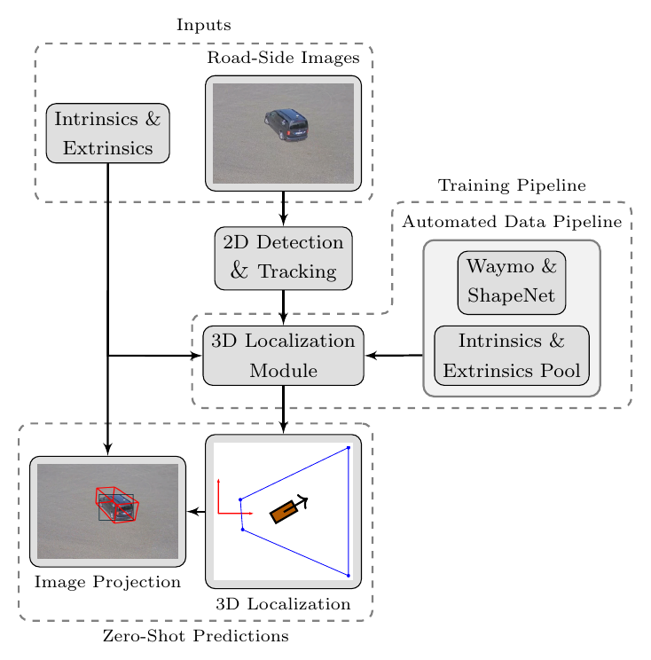
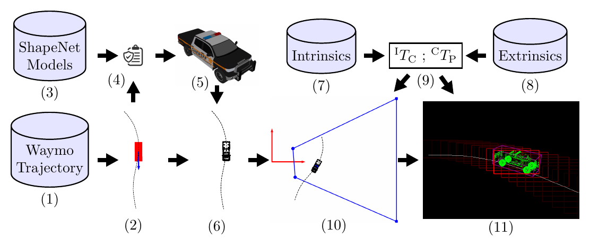
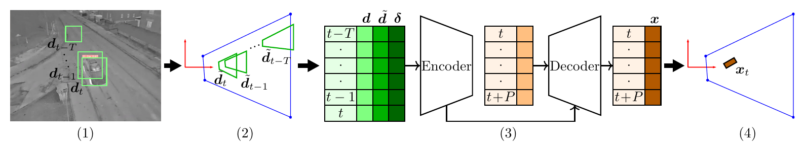
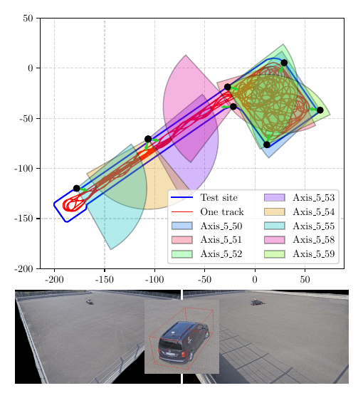
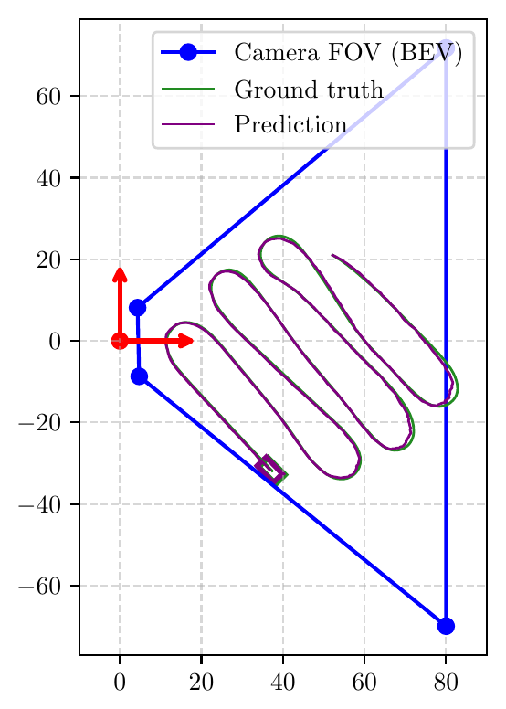

# ZS-Infra-3D-DriveInfra60

[](LICENSE)
[](https://zenodo.org/uploads/20789554)
[](#citation)

Official repository for **"A Zero-Shot Annotation-Free Framework for Efficient Monocular 3D Object Localization in Infrastructure Camera Systems"**.

This repo hosts **ZS-Infra3D**, a training-free, lightweight framework that localizes objects in 3D from static infrastructure cameras using only 2D detections, and **DriveInfra60**, a 60-minute multi-view, multi-camera test-track dataset with centimeter-accurate GNSS+RTK ground truth.

**Karthikeyan Chandra Sekaran¹, Abinav Kalyanasundaram¹, Michael Botsch¹, Wolfgang Utschick²**

¹ Technische Hochschule Ingolstadt (THI) &nbsp;&nbsp; ² Technische Universität München (TUM)

---

## Overview

Roadside cameras are increasingly central to intelligent transportation systems, yet monocular 3D object detection from these viewpoints is held back by costly data collection, manual 3D annotation, and heavy model architectures. ZS-Infra3D sidesteps all three: it consumes only a temporal sequence of 2D bounding boxes (from any off-the-shelf 2D detector) plus the camera's known intrinsics and extrinsics, and regresses full 3D object state — position, heading, and dimensions — without ever seeing a real 3D label during training.

The model is trained entirely on virtual 2D–3D correspondences produced by an automated data-generation pipeline that projects real-world trajectories from **Waymo** and 3D vehicle shapes from **ShapeNet** onto randomly sampled virtual cameras. Because training never touches a specific camera, the resulting model deploys **zero-shot** on any new infrastructure camera with known calibration.

<p align="center">
  
</p>

## Key Contributions

- **Automated 2D–3D data synthesis pipeline** — generates large-scale, accurate 2D–3D correspondences for arbitrary infrastructure cameras by combining real-world trajectories, 3D shape assets, and randomized camera intrinsics/extrinsics, removing the need for manual 3D annotation.
- **Training-free, lightweight 3D localization framework** — a transformer encoder–decoder that consumes 2D detection tracks and predicts 3D position, orientation, and dimensions with minimal compute, generalizing zero-shot to unseen cameras.
- **DriveInfra60 dataset** — a public 60-minute, multi-view test-track dataset with dynamic vehicle maneuvers, eight synchronized cameras, and centimeter-level GNSS+RTK ground truth for benchmarking infrastructure perception.

## Method

**1. Automated data-generation pipeline.** A trajectory is sampled from Waymo and paired with a ShapeNet 3D model matching the object's dimensions. The resulting point cloud is projected through a randomly sampled virtual camera (parameterized by focal length, height, pitch, and roll) to synthesize realistic 2D bounding boxes with known 3D ground truth — at scale, with no manual labeling.

<p align="center">
  
</p>

**2. Localization framework.** 2D detections are ray-cast onto the ground plane to obtain coarse 3D estimates, then concatenated with the raw 2D tracks and static camera parameters. A transformer encoder–decoder consumes this representation and predicts the full 3D trajectory (position, heading, dimensions) in a single non-autoregressive pass.

<p align="center">
  
</p>

## DriveInfra60 Dataset

DriveInfra60 addresses a gap in existing infrastructure datasets (e.g. RoScenes, UrbanIng), which mostly capture steady urban/highway traffic and rely on manual 3D annotation. DriveInfra60 instead provides **controlled, high-dynamics maneuvers** (sharp turns, dynamic driving) recorded on a closed test track, with annotation-free, centimeter-accurate ground truth.

<p align="center">
  
</p>

**Dataset highlights:**

- 60 minutes of high-dynamics vehicle motion on a closed test track, vehicles ranging from city cars to minivans
- 8 synchronized RGB cameras (1920×1080) with overlapping fields of view → 480 minutes of total multi-view video
- Exactly one vehicle per recording for unambiguous correspondence; visible in ≥2 (typically 3–4) camera views at a time
- Vehicle trajectories at ~1 cm accuracy via GNSS + RTK correction
- Full camera intrinsic and extrinsic calibration provided for every camera
- Collected at the CARISSMA Outdoor Test Facility

**Download:** the dataset is hosted on Zenodo → **[zenodo.org/uploads/20789554](https://zenodo.org/uploads/20789554)**

## Results

ZS-Infra3D is evaluated zero-shot against GARD (zero-shot baseline) and VL-SC (supervised baseline) on RoScenes, UrbanIng, and DriveInfra60, using Mean Absolute Error (MAE) in BEV and 3D box IoU.

| Dataset | Scene Type | GARD MAE ↓ (m) | VL-SC MAE ↓ (m) | **ZS-Infra3D MAE ↓ (m)** | **ZS-Infra3D IoU ↑** |
|---|---|---|---|---|---|
| RoScenes | Highway | 2.71 | 1.65 | **1.63** | 0.53 |
| UrbanIng | Urban (thermal) | 1.40 | 0.83 | 1.00 | 0.58 |
| DriveInfra60 (ours) | Test Track (dynamic) | 1.62 | 0.82 | **0.77** | **0.66** |

ZS-Infra3D shows competitive performance against compared baselines across all three datasets — including the supervised VL-SC — despite requiring no 3D labels or camera-specific fine-tuning.

<p align="center">
  
</p>

## Status

- [x] Paper
- [x] DriveInfra60 dataset release
- [ ] Training / inference code
- [ ] Pretrained model weights

The training and inference code for ZS-Infra3D is being prepared for release. This README will be updated with setup and usage instructions once the code is published.

## Citation

If you use this work, please cite:

```bibtex
@inproceedings{chandrasekaran2026zsinfra3d,
  title     = {A Zero-Shot Annotation-Free Framework for Efficient Monocular 3D Object Localization in Infrastructure Camera Systems},
  author    = {Chandra Sekaran, Karthikeyan and Kalyanasundaram, Abinav and Botsch, Michael and Utschick, Wolfgang},
  booktitle = {IEEE Intelligent Vehicles Symposium (IV)},
  year      = {2026}
}
```

## Acknowledgments

This work was funded by the Deutsche Forschungsgemeinschaft (DFG, German Research Foundation) – FIP 135/1, Project Number 549102058, and the Bavarian State Ministry of Science and the Arts (StMWK) – Project H2-F1116.IN/48/2 (SiRaMiS). The DriveInfra60 dataset was collected within the CARISSMA Outdoor Test Facility.

## License

This project is released under the [MIT License](LICENSE).

## Contact

For questions, please reach out via email (`firstname.lastname@thi.de`) or open an issue on this repository.
